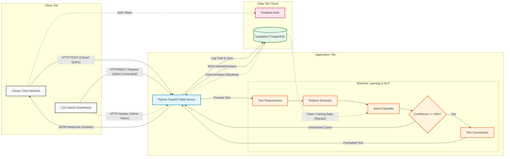
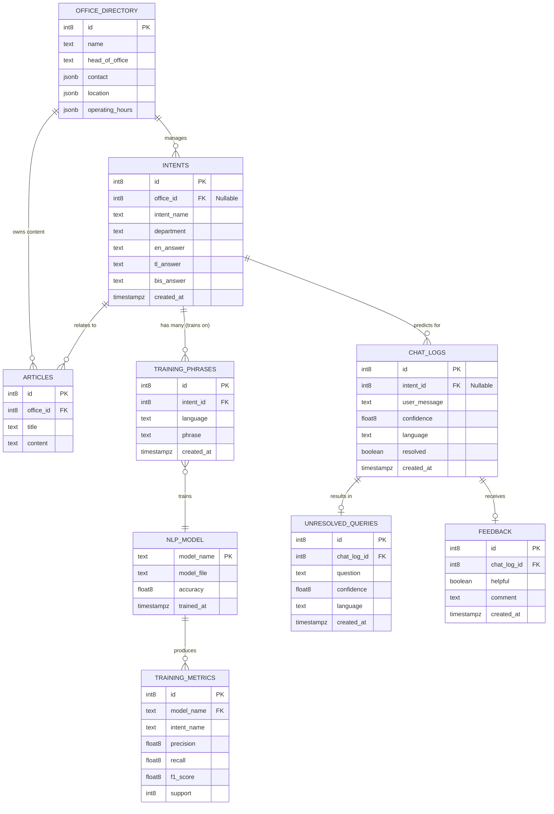

# Integrated LGU Chatbot & Admin Architecture

```mermaid
flowchart LR
    %% Styling
    classDef client fill:#f9f9f9,stroke:#333,stroke-width:2px;
    classDef server fill:#e1f5fe,stroke:#0277bd,stroke-width:2px;
    classDef ml fill:#fff3e0,stroke:#e65100,stroke-width:2px;
    classDef cloud fill:#e8f5e9,stroke:#2e7d32,stroke-width:2px;
    classDef auth fill:#fce4ec,stroke:#c2185b,stroke-width:2px;

    %% Column 1: Clients
    subgraph Client_Tier [Client Tier]
        direction TB
        Citizen[Citizen Chat Interface]:::client
        Admin[LGU Admin Dashboard]:::client
    end

    %% Column 2: Application
    subgraph Application_Tier [Application Tier]
        direction TB
        FastAPI[Python FastAPI Web Server]:::server
        
        subgraph NLP_Pipeline [Machine Learning & NLP]
            direction TB
            Pre[Text Preprocessor]:::ml
            Extract[Feature Extractor]:::ml
            Classify[Intent Classifier]:::ml
            Conf{Confidence >= 35%?}:::ml
            Summ[Text Summarizer]:::ml
            
            Pre --> Extract --> Classify --> Conf
            Conf -- Yes --> Summ
        end
    end

    %% Column 3: Cloud
    subgraph Data_Tier [Data Tier Cloud]
        direction TB
        Firebase[Firebase Auth]:::auth
        Supabase[(Supabase PostgreSQL)]:::cloud
    end

    %% Layout Links to force structure without drawing lines
    Citizen ~~~ Admin
    FastAPI ~~~ NLP_Pipeline

    %% Data Flow Connections
    Citizen -- "HTTP POST (Citizen Query)" --> FastAPI
    FastAPI -- "JSON Response (Answer)" --> Citizen
    Citizen -. "Auth Token" .-> Firebase
    
    Admin -- "HTTP/REST Request (Admin Command)" --> FastAPI
    Admin -. "HTTP Header (Admin Token)" .-> FastAPI
    
    FastAPI -- "Process Text" --> Pre
    Summ -- "Formatted Text" --> FastAPI
    Conf -- "Unresolved Query" --> FastAPI
    
    %% New Supabase Flow
    FastAPI -- "Log Chat & Sync" --> Supabase
    FastAPI -- "Write Intents/Answers" --> Supabase
    Supabase -. "Fetch Training Data (Retrain)" .-> Classify
    Supabase -. "Fetch Answers (Runtime)" .-> FastAPI
```

## Database Schema (Supabase)

```mermaid
erDiagram
    %% CORE KNOWLEDGE BASE
    OFFICE_DIRECTORY ||--o{ INTENTS : "manages"
    OFFICE_DIRECTORY ||--o{ ARTICLES : "owns content"
    
    INTENTS ||--o{ TRAINING_PHRASES : "has many (trains on)"
    INTENTS ||--o{ ARTICLES : "relates to"
    
    %% MACHINE LEARNING
    NLP_MODEL ||--o{ TRAINING_METRICS : "produces"
    TRAINING_PHRASES }o--|| NLP_MODEL : "trains"

    %% ANALYTICS & LOGS
    INTENTS ||--o{ CHAT_LOGS : "predicts for"
    CHAT_LOGS ||--o| UNRESOLVED_QUERIES : "results in"
    CHAT_LOGS ||--o| FEEDBACK : "receives"

    OFFICE_DIRECTORY {
        int8 id PK
        text name
        text head_of_office
        jsonb contact
        jsonb location
        jsonb operating_hours
    }

    ARTICLES {
        int8 id PK
        int8 office_id FK
        text title
        text content
    }

    INTENTS {
        int8 id PK
        int8 office_id FK "Nullable"
        text intent_name
        text department
        text en_answer
        text tl_answer
        text bis_answer
        timestampz created_at
    }

    TRAINING_PHRASES {
        int8 id PK
        int8 intent_id FK
        text language
        text phrase
        timestampz created_at
    }

    NLP_MODEL {
        text model_name PK
        text model_file
        float8 accuracy
        timestampz trained_at
    }

    TRAINING_METRICS {
        int8 id PK
        text model_name FK
        text intent_name
        float8 precision
        float8 recall
        float8 f1_score
        int8 support
    }

    CHAT_LOGS {
        int8 id PK
        int8 intent_id FK "Nullable"
        text user_message
        float8 confidence
        text language
        boolean resolved
        timestampz created_at
    }

    UNRESOLVED_QUERIES {
        int8 id PK
        int8 chat_log_id FK
        text question
        float8 confidence
        text language
        timestampz created_at
    }

    FEEDBACK {
        int8 id PK
        int8 chat_log_id FK
        boolean helpful
        text comment
        timestampz created_at
    }
```
